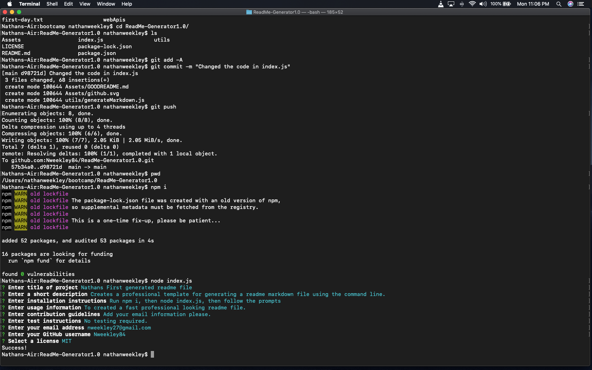

# README-generator

  
  

## _Command line application that generates a professional README for a new project_
 

## Table of Contents  

* [Installation](#Installation)  
* [Usage](#Usage)  
* [Contributing](#Contributing)   
* [Questions](#Questions)
* [License](#License)

## Installation  

Requires the npm Inquirer package:  `npm install inquirer`

## Usage  

**[Walkthrough Video](https://drive.google.com/file/d/1gPCJ_dqIpMakoYbMYaE8mSal5wnxktWe/view?usp=drive_link)**

1. Run `node index` in terminal  
2. Navigate through prompts  
3. A file named `GOODREADME.md` will be generated in current directory  

## Contributing  

Contributions welcome!
1. Fork this repository  
2. Create a new branch  
3. Commit/push your changes  
4. Create a new pull request  

## Questions  
Feel free to send me an email at nweekley27@gmail.com.  

## License
This project is [MIT](https://github.com/Nweekley84/ReadMe-Generator1.0/blob/main/LICENSE) licensed.  
© 2020 [Nathan Weekley](https://github.com/Nweekley84)  

---
 

 

